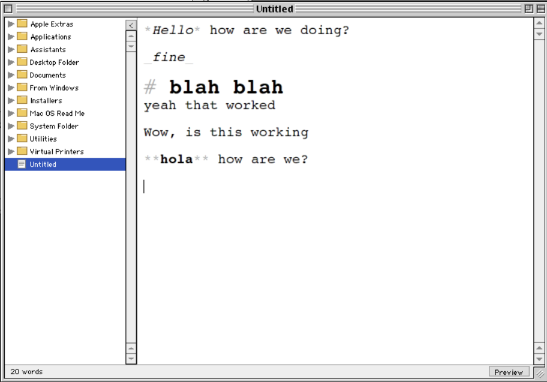

# Hans

A quiet Markdown writing environment for **Mac OS 9**: a library on the
left, a plain-text editor at the centre that styles your Markdown in place
as you type, a live preview, and a style check for clichés and filler.

Hans is a native PowerPC application built with the
[Retro68](https://github.com/autc04/Retro68) cross-compiler. It targets
Mac OS 9.1+ on any PowerPC Mac (G3/G4 era), using the Appearance Manager,
MLTE, and Navigation Services.



## What's in the box

| Piece | Where | What it is |
|-------|-------|------------|
| The app | `src/`, `rsrc/` | The Mac OS 9 application (C, Toolbox) |
| Build tools | `tools/` | Configure/build/run scripts |

## Features

- **Library pane** — point Hans at any folder; it browses the real
  subfolder/note hierarchy with disclosure triangles and its own
  scrollbar. New Note, New Folder, and Rename all live in the File menu.
  Notes are plain `.md` files you can open with anything else.
- **Inline Markdown editor** — you always edit plain text, but a short
  moment after you stop typing, headings grow, `**bold**` and `*italic*`
  render, inline `code` is tinted, list bullets and blockquotes are
  styled, and the syntax characters recede to grey. Choose your font
  (Geneva, Monaco, Charcoal, Palatino…) and size from the Format menu.
- **Focus mode** — **View ▸ Hide Library** (Cmd‑\\) collapses the sidebar to
  a slim reveal gutter so the editor fills the window; a little chevron tab
  on the divider toggles it either way. The title bar always shows the
  current note's name.
- **Status bar** — a quiet strip along the bottom with a live word count and
  a Preview toggle, in place of a chrome-heavy toolbar.
- **Preview** (Cmd-P) — a clean, read-only render with the syntax stripped
  and a basic, deliberately-limited set of Markdown features.
- **Style Check** (Cmd-K) — a user-initiated pass that flags clichés,
  filler, redundancies, and hedges from built-in lists plus your own list
  (Tools ▸ Edit User Word List). Click any result to jump to it.

## Building the app

You need the Retro68 toolchain built for PowerPC. If it lives at
`~/Retro68-build` (the default), just:

```sh
tools/build.sh
```

This produces, in `build/`:

- `Hans.bin` — a MacBinary of the app (transfer this to the Mac)
- `Hans.dsk` — an 800 K disk image containing the app
- `Hans.APPL` — the raw application file

To point at a toolchain elsewhere, edit `TOOLCHAIN` in `tools/build.sh`.

## Running it

### In an emulator (fast dev loop)

Hans runs under SheepShaver, Basilisk II, or QEMU with a bootable Mac OS 9
image. **You must supply the OS 9 install image (and, for real PowerPC
emulation, a Mac ROM) yourself** — they can't be distributed here.

Two ways to get the app in front of the emulator:

1. **Retro68 LaunchAPPL.** Configure `~/.LaunchAPPL.cfg` for your emulator,
   then `tools/run.sh`.
2. **Mount the disk image.** Add `build/Hans.dsk` as a disk in your
   emulator and drag `Hans` to the desktop.

### On real hardware (to verify)

Move `Hans.bin` to the Mac by any route that preserves the resource fork:

- **AppleShare / netatalk** over your LAN, or
- a **CF/SD card** in an IDE adapter, or
- burn `Hans.dsk` to media the Mac can read.

`Hans.bin` is MacBinary; decode it on the Mac with Stuffit Expander (or
transfer `Hans.dsk` and copy the app out of it).

## Source layout

```
src/
  main.c        Toolbox init, event loop, menu dispatch, window chrome
                (divider, collapse tab, status bar, title bar)
  hans.h        Shared types and module interfaces
  prefs.c       Preferences file (font, library folder)
  dialogutil.c  Small dialog/string helpers
  markdown.c    The line-based Markdown parser (shared by editor & preview)
  editor.c      MLTE editor: inline restyling, load/save, word count
  library.c     Custom-drawn folder/file tree with scrollbar
  preview.c     Read-only rendered preview
  stylecheck.c  Idiom/overused-word checker + results window
rsrc/
  hans.r        Menus (incl. View), dialogs, alerts, word lists, Finder/version
tests/
  run.sh        Host-side regression tests (no Retro68 needed); currently
                covers the Markdown parser that drives the in-situ styling
```

## Notes & limits

- The style checker's built-in lists live in `rsrc/hans.r` (`TEXT` 300–303)
  and can be extended per-user via Tools ▸ Edit User Word List.
- Notes are plain `.md` files (LF line endings) in your chosen library
  folder, editable by any other app.
